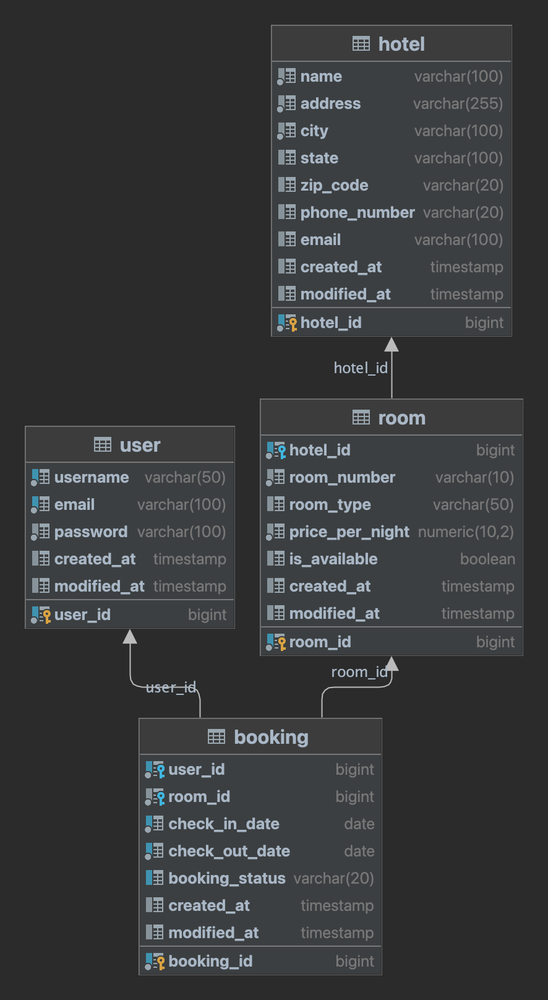
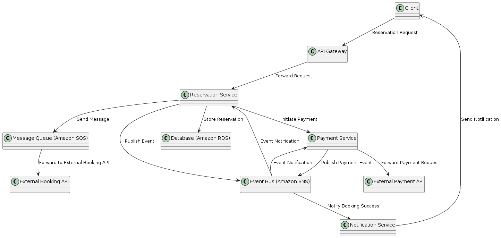

# Section 1: Hotel Booking Application

This is project for learning and testing to met applicant for HRS recruitment process

### Technologies Used

- Java 17
- Spring Boot (MVC, Data JPA, Spring Doc)
- Hibernate ORM
- PostgreSQL
- JUnit and Mockito for unit testing

### API Documentation:

After successfully running the application, you can access the API documentation
at http://localhost:8081/swagger-ui/index.html#.

### Set up the database:

Execute `create_db.sql` script located in `src/main/resources/sql` to create the database schema.
Configure the datasource in `application.properties` located in `src/main/resources`.

##### Below is the ERD:

# Section 2: Architecture and Design.

Objectives:

1. Design a higly available and fault-tolerant EDA-based hotel reservation system using AWS services.
2. In your architecture, demonstrate how you would integrate external APIs for making bookings and payments into the
   system.
3. Provide recommendations for future enhancements or optimizations based on performance metrics and customer feedback.

Here is my diagram, and the question for thought should be in the next phase.

